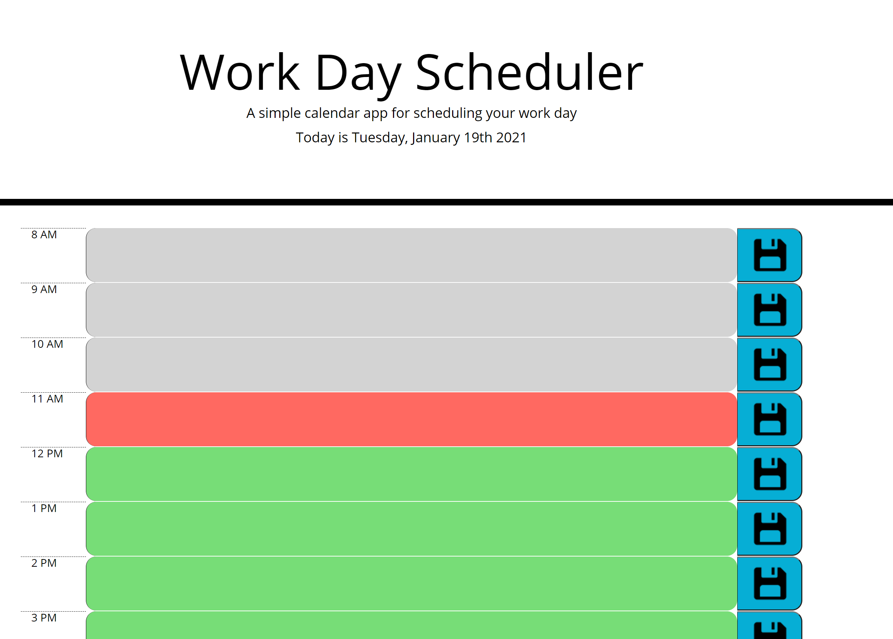
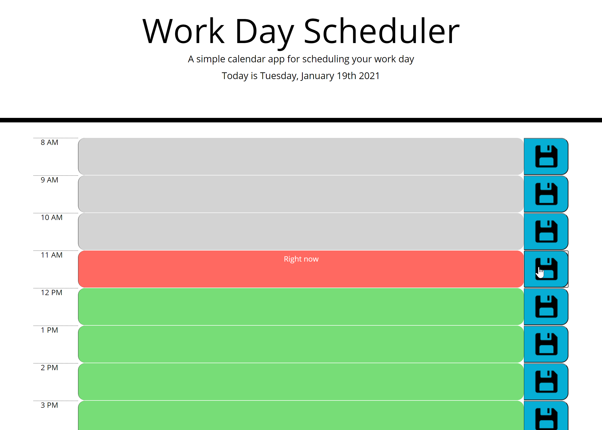

# Schedule Application
# A schedule application that allows users to enter events for their work day hours. 

Schedules are hard to keep track of. This application allows users to enter events into different time slots, based off of work hours, and the events will be saved locally. 
Live Application available at - https://alexjalva.github.io/ScheduleApplication/

## Installation
 Files can be downloaded at : https://github.com/Alexjalva/ScheduleApplication.git

 All files needed are contained within the repository. The main folder needs to include the index.html and style.css. As long as all files are included, and placed in that order, the html should be able to run functions from the script file. 

 ## Usage
 ### How to access the page

Webpage can be loaded based off of html in main repository or off the above live application link. 

### How to Navigate the Website

All content and functionality exists on the main page. Users may need to scroll up or down to access all hours.  

Empty View - Users will initially see an empty schedule with no events inputted. They should see the current date at the top and empty time blocks in the schedule. The current hour should appear as red. Past hours should appear as gray. Future hours should appear as green. 

Event Entry - Users can enter text into the center time blocks. Upon hitting the save button, the text will be saved.  

Multiple Events Viewing and Setting - Users can view events that they have already set and can update them by typing over them and saving that block. 

## Credits
Original page was created by Alexander Alvarado

## License
MIT License

Copyright (c) 2021 Alexander Alvarado 

Permission is hereby granted, free of charge, to any person obtaining a copy
of this software and associated documentation files (the "Software"), to deal
in the Software without restriction, including without limitation the rights
to use, copy, modify, merge, publish, distribute, sublicense, and/or sell
copies of the Software, and to permit persons to whom the Software is
furnished to do so, subject to the following conditions:

The above copyright notice and this permission notice shall be included in all
copies or substantial portions of the Software.

THE SOFTWARE IS PROVIDED "AS IS", WITHOUT WARRANTY OF ANY KIND, EXPRESS OR
IMPLIED, INCLUDING BUT NOT LIMITED TO THE WARRANTIES OF MERCHANTABILITY,
FITNESS FOR A PARTICULAR PURPOSE AND NONINFRINGEMENT. IN NO EVENT SHALL THE
AUTHORS OR COPYRIGHT HOLDERS BE LIABLE FOR ANY CLAIM, DAMAGES OR OTHER
LIABILITY, WHETHER IN AN ACTION OF CONTRACT, TORT OR OTHERWISE, ARISING FROM,
OUT OF OR IN CONNECTION WITH THE SOFTWARE OR THE USE OR OTHER DEALINGS IN THE
SOFTWARE.
